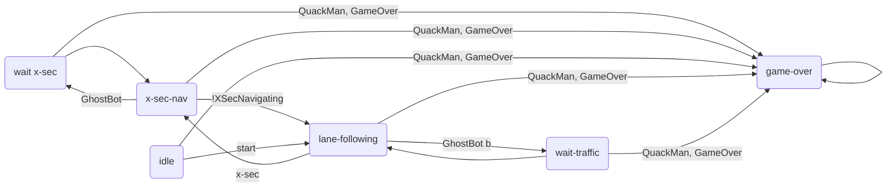

# state_controller
ROS package for high level control of the GhostBots.

## Nodes
These package consists of the following nodes, each having a specific functionality.

### StateMachine
The state machine node is responsible to manage the state of the GhostBot and send out commands to other nodes depending on the current state.
This diagram shows the state machine implemented in this node.

:exclamation: add `game_state` (received from game master) transitions to game over

:exclamation: add `game-won` state

:warning: Consider transitions from lane following to wait states

The node is listening on these channels for boolean flags for the inputs
- `ghost_bot`
- `ghost_bot_back`
- `quack_man`
- `x_sec`
- `x_sec_navigating`

The node is listening on the `game_state` channel for the current game state.
The game state is published by the GameMasterConnector as string and can be one of the following values
- `IDLE`: The game is not running, waiting for bots to join.
- `RUNNING`: The game is running, bots can send status updates, QuackMan can send the current score.
- `GAME_OVER`: QuackMan has been caught by a bot.
- `GAME_WON`: QuackMan has collected all checkpoints and won the game.

The node will send out boolean flag commands on these channels
- `lane_following`, if set to true the lane following node should start driving
- `x_sec_go`, if set to true the x-sec navigation should start navigating through the cross-section
- `game_over`, if set to true the QuackMan was detected and the game is over

To run the test cases execute `python -m unittest discover tests` at the project root.

### GameMasterConnector
This node is responsible for the communication with the game master.
It is reusable for the GhostBots and the QuackMan by starting it with the appropriate launch file.
- `game_master_connector_quackmann.launch`
- `game_master_connector_ghostbot.launch`

How communication with the game master works is documented [here](https://github.com/Duckietown-QuackMan/game_master).

This node will publish the game state as string on the topic `game_state`.
The node listens on these channels
- `all_chekpoints_collected`
- `score_update`
- `checkpoint_timeout`
- `game_over`
and informs the game master if all checkpoints were collected, the QuackMan achieved a new score, or the QuackMan was detected by a GhostBot and the game is over (when running on the appropriate bot type).