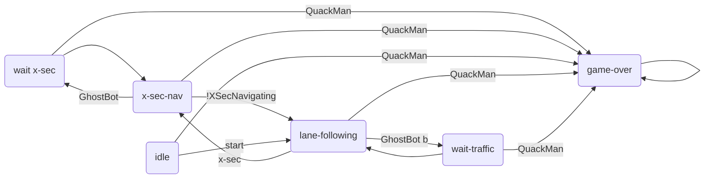

# state_controller
ROS package for high level control of the GhostBots.

## Nodes
These package consists of the following nodes, each having a specific functionality.

### StateMachine
The state machine node is responsible to manage the state of the GhostBot and send out commands to other nodes depending on the current state.
This diagram shows the state machine implemented in this node.

:warning: Consider transitions from lane following to wait states

The node is listening on these channels for boolean flags for the inputs
- `ghost_bot`
- `ghost_bot_back`
- `quack_man`
- `x_sec`
- `x_sec_navigating`

The node is listening on the `game_state` channel for the current game state.

The node will send out boolean flag commands on these channels
- `lane_following`, if set to true the lane following node should start driving
- `x_sec_go`, if set set to true the x-sec navigation should start navigating through the cross section
- `game_over`, if set to true the QuackMan was detected and the game is over

To run the test cases execute `python -m unittest discover tests` at the project root.