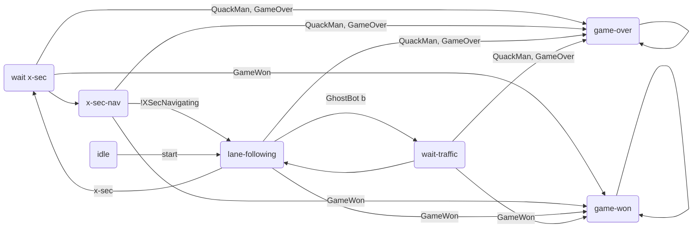
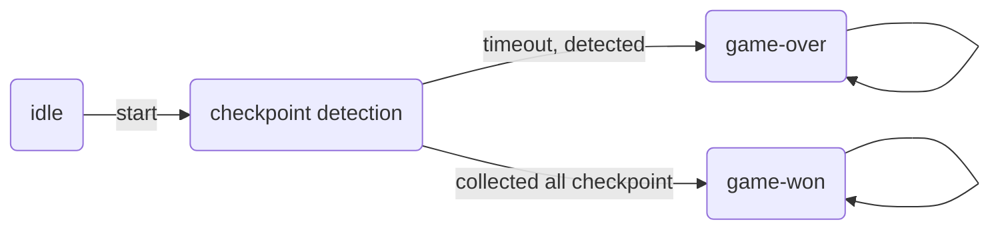
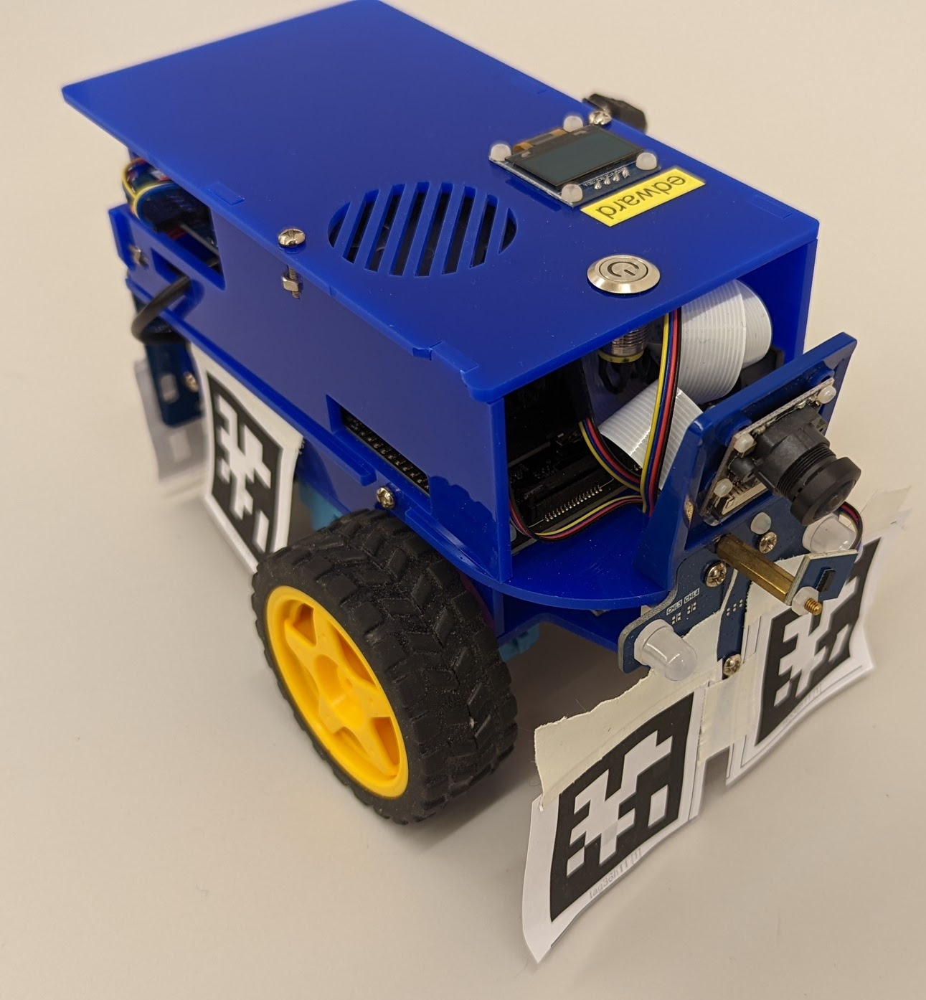
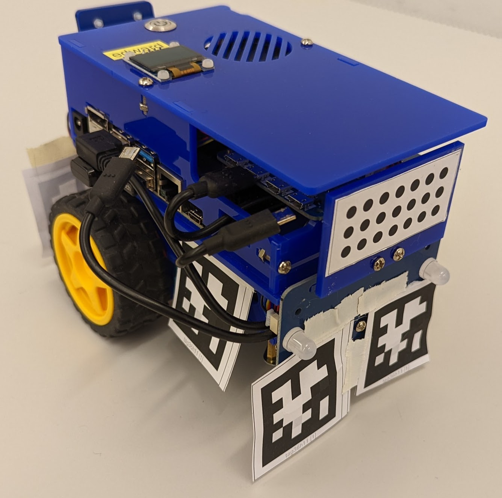

# state_controller
ROS package for high level control of the GhostBots.

## Nodes
These package consists of the following nodes, each having a specific functionality.

### GhostBot state_machine
The state machine node is responsible to manage the state of the GhostBots and send out commands to other nodes depending on the current state.

This diagram shows the state machine implemented in the "state_machine" node.


The node is listening on these channels for boolean flags for the inputs
- `ghost_bot`
- `ghost_bot_back`
- `quack_man`
- `x_sec`
- `x_sec_navigating`

The node is listening on the `game_state` channel for the current game state.
The game state is published by the GameMasterConnector as string and can be one of the following values
- `IDLE`: The game is not running, waiting for bots to join.
- `RUNNING`: The game is running, bots can send status updates, QuackMan can send the current score.
- `GAME_OVER`: QuackMan has been caught by a bot.
- `GAME_WON`: QuackMan has collected all checkpoints and won the game.


The node will send out boolean flag commands on these channels
- `lane_following`, if set to true the lane following node should start driving
- `x_sec_go`, if set to true the x-sec navigation should start navigating through the cross-section
- `game_over`, if set to true the QuackMan was detected and the game is over

To run the test cases execute `python -m unittest discover tests` at the project root.
### qm_state_machine
This node is responsible to manage the state of the QuackMan and send out commands to other nodes depending on the current state.

This diagram shows the state machine implemented in the "qm_state_machine" node.

### game_master_connector
This node is responsible for the communication with the game master.
It is reusable for the GhostBots and the QuackMan by starting it with the appropriate launch file.
- `game_master_connector_quackmann.launch`
- `game_master_connector_ghostbot.launch`

How communication with the game master works is documented [here](https://github.com/Duckietown-QuackMan/game_master).

This node will publish the game state as string on the topic `game_state`.
The node listens on these channels
- `all_chekpoints_collected`
- `score_update`
- `checkpoint_timeout`
- `game_over`

and informs the game master if all checkpoints were collected, the QuackMan achieved a new score, or the QuackMan was detected by a GhostBot and the game is over (when running on the appropriate bot type).

The communicate with the game master two python packages are required:
- `websocket-client`: provides a nice interface for websocket communication
- `rel`: to handle the websocket connections in the background


## Instructions
To run the QuackMan game you need 3 duckies and one external computer to run the game master.

### Game Master
On the external computer the [game master](https://github.com/Duckietown-QuackMan/game_master) has to be downloaded. It requires Java 21 and maven. By default the game master expects 2 GhostBots and 1 QuackMan. The number of expected GhostBots can be changed in the `src/main/java/ch/quack/man/Main.java` file if necessary.
To run the game master execute the following commands in the game master directory.
```bash
mvn clean package
java -jar target/game_master-1.0-SNAPSHOT.jar 
```

### Bots (GhostBots and QuackMan)
The GhostBot depends on these ros packages which have to be downloaded and built on the robot.
- [state_controller](https://github.com/Duckietown-QuackMan/state_controller)
- [x-sec-driving](https://github.com/Duckietown-QuackMan/x-sec-driving)
- [apriltag_detection](https://github.com/Duckietown-QuackMan/apriltag_detection)
- [LED_controller](https://github.com/Duckietown-QuackMan/LED_controller)

For each package python dependencies have to be installed if there exists a requirements file in the `src` directory, to do so go to the `src` folder of each package and execute:
```bash
pip install -r requirements.txt
```
That the Bots can communicate with the game master, the IP address of the external computer has to be set in the `state_controller` package to to so open the `src/params/game_master.yaml` file and fill in the IP address of the external computer in the `url` field, like this `ws://<IP_ADDRESS>:8025/ws`.

Each bot has to be equiped with apriltags on each side like in these pictures, the apriltag ids for each bot are listed in the table below.



| Bot        | Front | Left | Back | Right |
| ---------- | ----- | ---- | ---- | ----- |
| QuackMan   | 1     | 1    | 1    | 1     |
| GhostBot 1 | 2     | 2    | 3    | 2     |
| GhostBot 2 | 2     | 2    | 3    | 2     |

Next the lane following container has to be started on both GhostBots.
Replace the `ROBOT_HOSTNAME` with your actual robot name.
``` bash
docker run -it --rm --name=lane-following --net host --privileged  --memory "800m" --memory-swap="2800m" -v /data:/data -v /var/run/avahi-daemon/socket:/var/run/avahi-daemon/socket duckietown/dt-core:daffy-arm64v8 roslaunch duckietown_demos lane_following.launch veh:=ROBOT_HOSTNAME
```

After the preparations are done and the game master and lane following container is running each Bot can be started by first building and sourcing the ros packages `catkin build & source devel/setup.bash` and the executing the appropriate launch file for each bot.
- QuackMan: `roslaunch state_controller quackman.launch`
- GhostBot 1: `roslaunch state_controller ghostbot_priority.launch`
- GhostBot 2: `roslaunch state_controller ghostbot_secondary.launch`

Have fun playing the QuackMan game!

## Demo
Video recording of each functionnality of the QuackMan game may be found in this [repository](https://ethz-my.sharepoint.com/:f:/g/personal/cormond_ethz_ch/EouKoV57MIZMunmnNR6zZwEBwZPoDpa4g1f5z6OWTcCZWw?e=avCZ1q)
